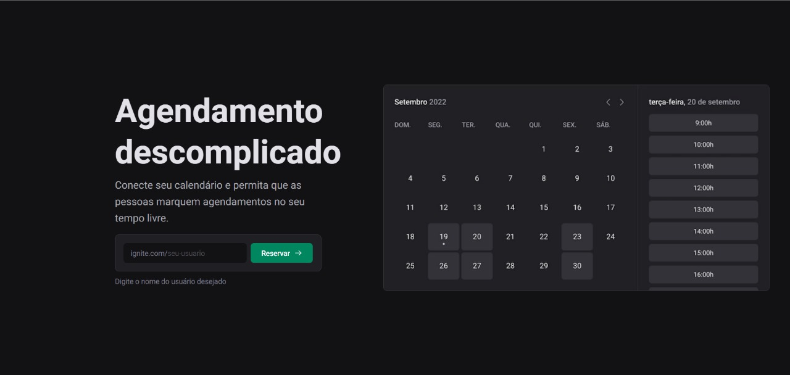
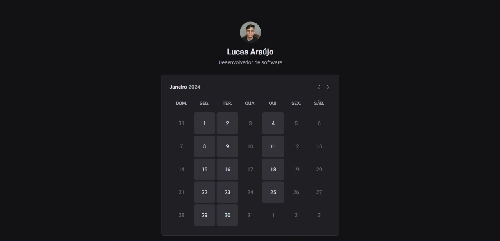
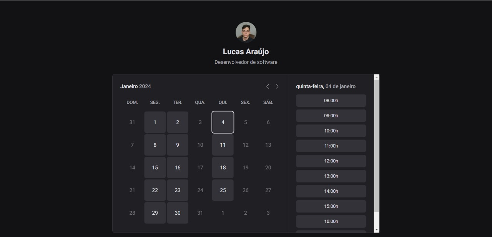
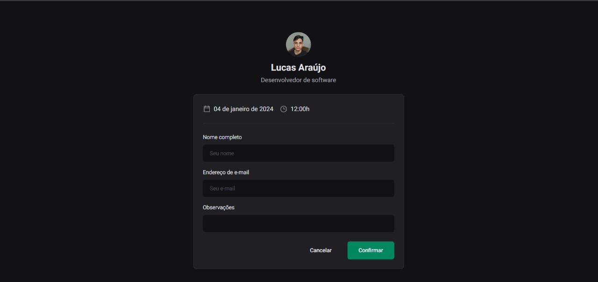

# Ignite Call

O Ignite Call é um projeto desenvolvido como parte do curso da Rocketseat. Ele permite que os usuários conectem seus calendários do Google e facilitem o agendamento de compromissos nos períodos de tempo livre.

<div align="center">
  
  
  
  
</div>
=======
## Tecnologias

- Next.js
- Typescript
- Prisma
- Google APIs
- Google Cloud Platform
- Axios
- Next Seo
- Nookies
- React Hook Form
- Design System
- Stitches
- Phosphor icons
- Zod
>>>>>>> 0169cde04768d2c7b0b5339000a9a8afe6a8bca5

## Funcionalidades

- Conexão com o Calendário do Google
- Permite o agendamento de compromissos no tempo livre disponível
- Tecnologias utilizadas: Next.js, Prisma, Axios, Next-Auth, Nookies e Zod.

## Requisitos

Certifique-se de ter instalado em sua máquina:

- Node.js
- npm ou yarn
- Conta no Google para acesso ao Calendário

## Instalação

1. Clone o repositório:

```bash
git clone https://github.com/lucasadsr/ignite-call.git
```

2. Acesse o diretório do projeto:

```bash
cd ignite-call
```

3. Instale as dependências:

```bash
npm install
# ou
yarn
```

4. Rode as migrações do prisma:

```bash
npx prisma migrate dev
```

5. Configuração do Google API:

- Acesse o Google Developers Console
- Crie um novo projeto ou utilize um existente
- Ative a API do Google Calendar para o projeto
- Crie credenciais de acesso (OAuth Client ID) e adicione o URL de redirecionamento (geralmente http://localhost:3000/api/auth/callback/google)
- Copie as credenciais geradas (Client ID e Client Secret) e adicione ao arquivo de configuração do projeto

6. Inicialize o servidor:

```bash
npm run dev
# ou
yarn dev
```

O servidor estará rodando em `http://localhost:3000`
